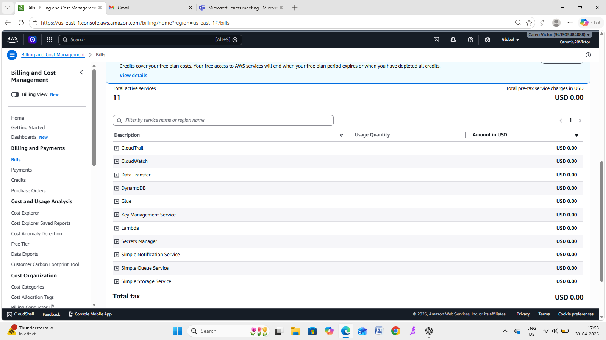

# Sentinel Zero

# 🚨 Sentinel Zero – AWS Security Monitoring System

A real-time cloud security monitoring system built on AWS that detects anomalous user behavior, generates alerts, and visualizes threats through an interactive dashboard.

---

## 🧠 Project Overview

Sentinel Zero simulates a **Security Operations Center (SOC)** environment by continuously monitoring AWS activity logs, identifying suspicious patterns, and presenting insights through a live dashboard.

The system is designed to detect:
- Unusual login locations  
- High-frequency activity  
- Suspicious API usage patterns  

---

## 🏗️ Architecture
```
CloudTrail 
   ↓
EventBridge 
   ↓
Lambda (Detection Logic)
   ↓
DynamoDB (Storage)
   ↓
SNS (Email Alerts)
   ↓
Streamlit Dashboard (Visualization)
```


---

## ⚙️ Key Features

### 🔍 Threat Detection
- Detects **new IP access**
- Identifies **high-frequency activity**
- Flags **multiple anomaly signals**
- Assigns **severity levels (HIGH / MEDIUM / LOW)**

---

### 🚨 Alerting System
- Real-time alerts triggered via Lambda
- Email notifications using SNS
- Risk-based classification of threats

---

### 📦 Data Storage
- DynamoDB stores:
  - User behavior history  
  - Alert logs  

---

### 📊 Interactive Dashboard
- Live AWS-connected dashboard
- Filter alerts by severity
- View suspicious activity patterns

---

### 🌍 Attacker Intelligence
- Converts IP → **Country**
- Helps identify attacker origin

---

### 🔐 Secure Access
- Login-protected dashboard
- Simulates role-based access control

---

## 🖥️ Dashboard Preview

### 🔐 Login Page


---

### 📊 Main Dashboard


---

### 📄 Alert Data


---

### 🌍 Top Suspicious IPs


---

### 📈 Activity Timeline


---

## ☁️ AWS Components

### 📦 DynamoDB Tables


---

### ⚡ Lambda Function


---

### 🔁 EventBridge Rule


---

## 🛠️ Tech Stack

- **AWS Services**
  - Lambda  
  - DynamoDB  
  - EventBridge  
  - SNS  
  - CloudTrail  

- **Backend**
  - Python (Boto3)

- **Frontend**
  - Streamlit  

- **Data Processing**
  - Pandas  

---

## ▶️ Running the Dashboard

```bash
python -m streamlit run dashboard/dashboard_app.py
```

## Project Structure

```
sentinel-zero/
│
├── dashboard/
│   └── dashboard_app.py
│
├── lambda/
│   └── lambda_function.py
│
├── docs/
│   └── images/
│       ├── login.png
│       ├── dashboard.png
│       ├── alerts.png
│       ├── top_ips.png
│       ├── timeline.png
│       ├── dynamodb.png
│       ├── lambda.png
│       └── eventbridge.png
│
├── requirements.txt
├── README.md
└── .gitignore
```

## 🚀 Future Enhancements
🌍 Geo-mapping visualization (map-based attacks)

🔐 Integration with AWS IAM / Cognito for real authentication

📊 Advanced analytics (trend prediction)

🚨 Slack / webhook alert integration

🧠 Machine learning–based anomaly detection

---

## 💡 Deployment Considerations (Free Tier vs Production)

### 🆓 Built Using AWS Free Tier

This project was designed and implemented under **AWS Free Tier constraints**, ensuring minimal cost usage while still demonstrating a complete event-driven security monitoring system.

- Low-volume event processing  
- Minimal DynamoDB storage  
- Limited Lambda executions  
- Basic alerting via SNS  

This makes the system **cost-efficient and suitable for learning and prototyping**.

### 🧾 Billing Verification



- ✅ Total cost: **$0.00**
- ✅ Efficient use of serverless architecture
- ✅ No idle or over-provisioned resources
---

### 🚀 Production-Scale Considerations

If deployed in a real-world production environment, the system would require:

#### 🔧 Scalability
- High-frequency event handling (millions of logs)
- Optimized Lambda concurrency and performance
- DynamoDB scaling (on-demand or provisioned capacity)

#### 💰 Cost Implications
- Increased Lambda execution costs  
- DynamoDB read/write throughput charges  
- CloudWatch log storage costs  
- SNS / notification scaling  

#### 🔐 Security Enhancements
- Integration with **AWS IAM / Cognito** for real authentication  
- Secure API gateways  
- Encryption and access control policies  

#### 📊 Advanced Monitoring
- Integration with **SIEM tools**
- Real-time dashboards with streaming data
- Alert prioritization and incident response workflows  

---

### 🧠 Key Takeaway

This project demonstrates how a **cost-effective prototype** built within AWS Free Tier can be extended into a **scalable, production-grade security monitoring system** with the right architectural enhancements.

## 👥 Contributors
Caren Victor and J Aesu Keerthana

